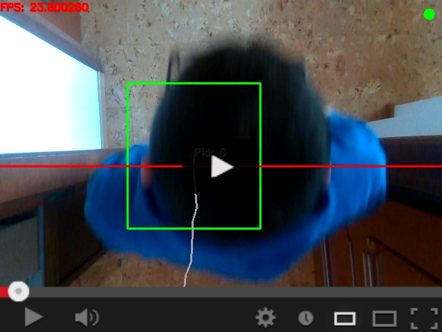
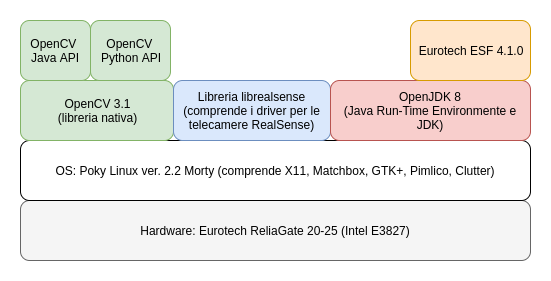

# RealSense Passenger Counter (RSPCN)
This is going to be my Electronics Engineering Master's Thesis.

### Goal
Developing a Passenger Counter (PCN) in a transportation environment using OpenCV and its hardware acceleration capabilities on different hardware platforms. In this implementation I am using the Intel RealSense cameras.

### Hardware
Target platform: 
* Eurotech ReliGATE 20-25 (Intel E3827 Atom Processor)

Video acquisition:
* Intel RealSense SR300
* Intel RealSense R200

### Tools
For the development I've used:
* [OpenCV](http://opencv.org/)
* Intel RealSense Library: [librealsense](https://github.com/IntelRealSense/librealsense)
* Simplified Wrapper and Interface Generator: [SWIG](http://www.swig.org/)
* [JavaCPP](https://github.com/bytedeco/javacpp) and its presets for the librealsense library

To build the ReliGATE 20-25 image I've used:
* [Yocto Project](https://www.yoctoproject.org/)
    * [poky](http://git.yoctoproject.org/cgit.cgi/poky): base repository
    * [meta-intel](http://git.yoctoproject.org/cgit.cgi/meta-intel): layer for targeting the Intel Atom processor
    * [meta-openembedded](https://github.com/openembedded/meta-openembedded): layer containing OpenCV recipes
    * [meta-intel-realsense](https://github.com/IntelRealSense/meta-intel-realsense.git): layer containig librealsense library
    * [meta-java](http://git.yoctoproject.org/cgit/cgit.cgi/meta-java): layer containing the Java Run-time Environment

### Performance
Performance achived on Eurotech platform:
* Intel RealSense SR300 @640x480 30FPS = [10; 400] cm range
* Intel RealSense R200  @320x240 60FPS = [30; 150] cm range

### Project structure
Folder structure and their purpose:

- **docs**: documentation.
- **build_config**: here you will find the configuration files and instruction to build the Yocto project custom distro for the 20-25 platform. It will contain all the needed projects to run the code in this repository.
- **cpp_src**: here you will find the C++ version of the code.
- **java_wrap**: here you will find a java wrap of the an obsolete version of the C++ code. It uses SWIG to generate the Java wrapper.
- **java_src**: here you will find the Java version of the code. It depends on the JavaCPP project.
- **osgi_src**: WIP

### Software stack

### Roadmap

- [X] RSPCN C++ version  => Release v2.0
- [X] RSPCN Java version => Release v3.0
- [ ] RSPCN OSGi version 

### Improvements

- build_config
  - Custom recipe to auto install needed jar files in the root directory

- cpp_src
  - Improve counting algorithm.
  - Improve tracking algorithm using Haar Cascade Classifiers

- java_src
  - Follow improvements of the cpp version

- osgi_src
  - Eclipse configuration to automatically launch the program on the target platform from the host machine

- docs
  - Add photos in the README file
